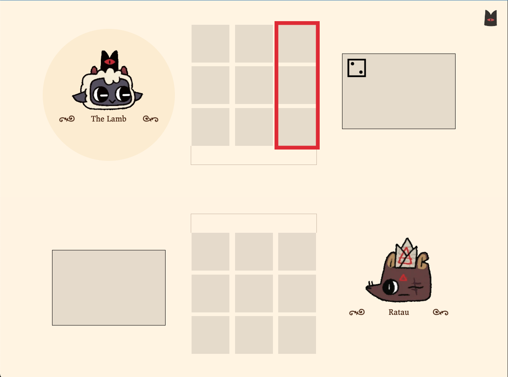
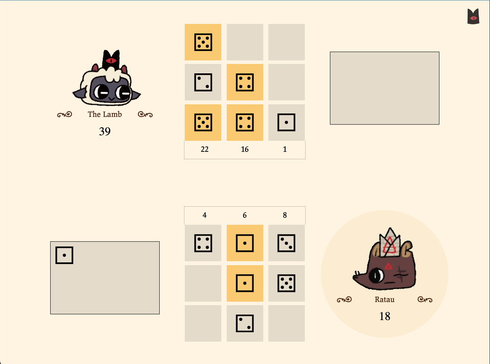
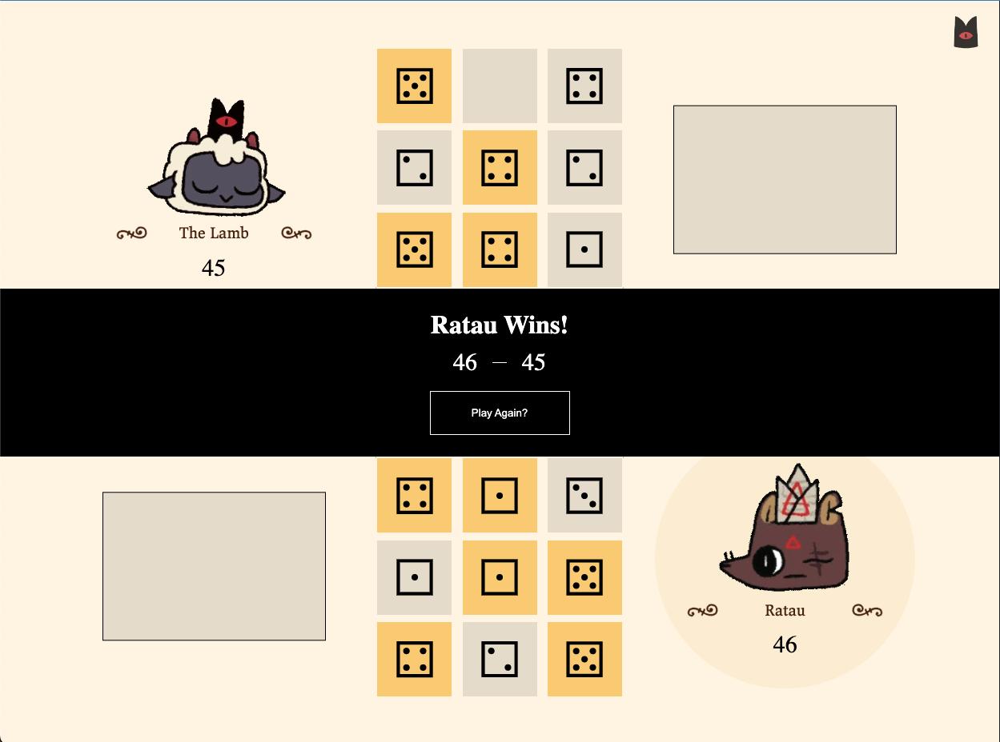
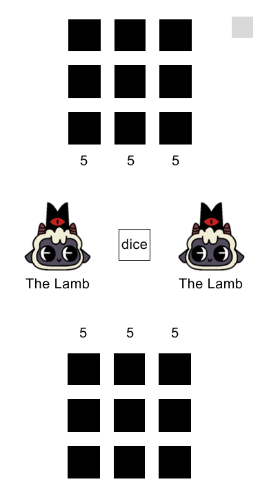
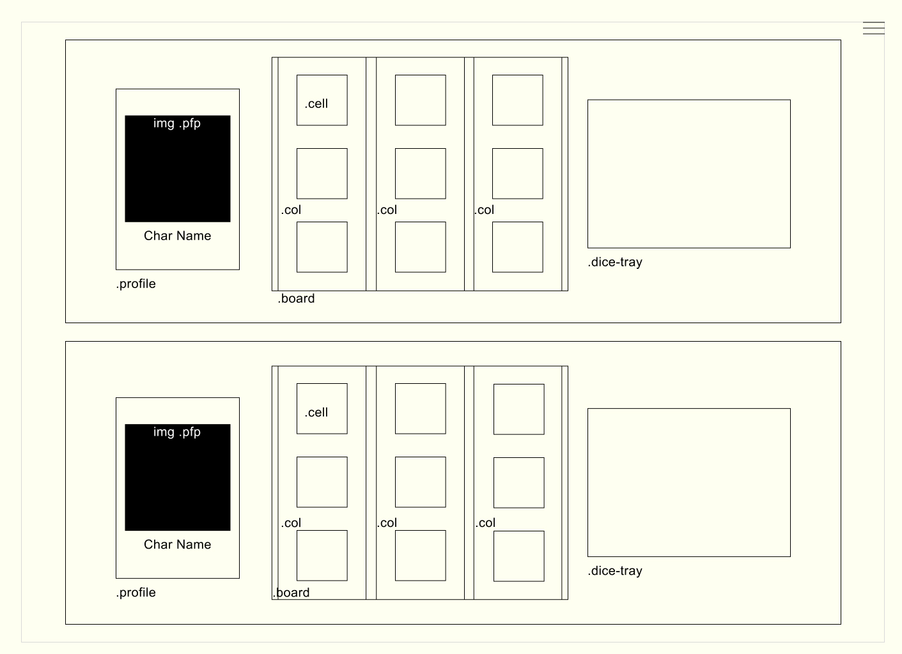

Requirements: https://git.generalassemb.ly/SEIR-Boston/project-1

# --- 🐑 🎲 Knucklebones 🎲 🐑 ---
### A Dice Mini-game from [Cult of the Lamb](https://www.cultofthelamb.com/) (a 2019 videogame)
Cult of the Lamb is a video game developed by indie developer Massive Monster and published by Devolver Digital. Knucklebones is a dice mini-game in Cult of the Lamb in which a player wagers coins against a CPU opponent. [Sample gameplay can be found here.](https://www.youtube.com/watch?v=y4PfvZiEs5E)

<u>**Game Rules**</u>
 - The game consists of two 3x3 boards, each belonging to their respective player.
 - The players take turns. On a player's turn, they roll a single 6-sided die, and must place it in a column on their board. A filled column does not accept any more dice.
 - Each player has a score, which is the sum of all the dice values on their board. The score awarded by each column is also displayed.
 - If a player places multiple dice of the same value in the same column, the score awarded for each of those dice is multiplied by the number of dice of the same value in that column. e.g. if a column contains 4-1-4, then the score for that column is 4x2 + 1x1 + 4x2 = 17.
 - When a player places a die, all dice of the same value in the corresponding column of the opponent's board gets destroyed. Players can use this mechanic to destroy their opponent's high-scoring combos.
 - The game ends when either player completely fills up their 3x3 board. The player with the higher score wins.

## Section 2: Screenshot(s):

#### Game Screenshots  

  

  

#### Mobile-First Lo-fi Mockup  

#### Wireframe of Knucklebones UI  

## Section 3: Technologies Used 

 - HTML
 - CSS
 - Javascript
 - Green Sock (GSAP)

## Section 4: Getting Started  

In this section include the link to your deployed game and any instructions you deem important.
https://abbenei.github.io/knucklebones/

#### How to Play
 1. In order to play, hover over the board and choose which column you'd like to place a dice into. Click to place the dice. 
 2. Your score will increase by the amount on the dice that you placed. To increase your score further, place dice of the same number in the same column.
 3. In order to reduce your opponent's score, place your dice in the column opposite theirs. If dice in your opponent's column contains the same number as your dice, the dice in your opponent's column will be removed from the board and their score will decrease. 
 4. Fill up your board in order to end the game. If your score is higher, you win! 

## Section 5: Next Steps

Planned future enhancements (icebox items).
 - Adding a menu page (with start game, how to play buttons) that can be used to start the game
 - Menu that allows user to see how to play and exit to main menu
 - Animations on dice removal and shift
 - A CPU that plays against the user (singleplayer mode)

## Pseudocode

1. Define required variables  
    a. Player object that contains  
        &nbsp;&nbsp;&nbsp;&nbsp;i. Player name   
         &nbsp;&nbsp;&nbsp;&nbsp;ii. Player character choice    
         &nbsp;&nbsp;&nbsp;&nbsp;iii. Player color?   
    b. Turn: either 1 or -1
    c. column object from Column class
    d. Top Game board, bottom game board   
    e. Game board arrays, one per board, that track changes and score
    f. Player score variables, as part of Col object?
    g. Column class {}
        &nbsp;&nbsp;&nbsp;&nbsp; - column number in board (to track on gameboard array)  
        &nbsp;&nbsp;&nbsp;&nbsp;- opposite column reference  
        &nbsp;&nbsp;&nbsp;&nbsp;- method for smash dice  
        &nbsp;&nbsp;&nbsp;&nbsp;- method for add up dice in column, checking if duplicate dice exist, calculating score appropriately, adding the score to the score variable and rendering visual changes to the appropriate duplicate dice  
        &nbsp;&nbsp;&nbsp;&nbsp; - method for updating the game board object  
        &nbsp;&nbsp;&nbsp;&nbsp;- Player score variable array of three, one per column  
        &nbsp;&nbsp;&nbsp;&nbsp;- Global player score variable  
        &nbsp;&nbsp;&nbsp;&nbsp;- AmIFull variable/method  
    h. Predictive function that determines what the player score will be based on a move, for potential CPU and difficulty changes (allows CPU to evaluate what move is best, and then not do that if it's on easy mode)

4. Upon landing the app should  
    a. Load a pre-game menu screen  
    b. Wait for user to pick to play the game and choose a difficulty.  
        &nbsp;&nbsp;&nbsp;&nbsp;- player makes a wager?  
    c. Transition to and render game UI, removing pre-game menu UI  
    d. Initialize the state variables  
    e. Render those variables to the page  
    f. Wait for the user to interact by rolling dice on their turn

5. Handle a player interaction  
    a. Player clicks to roll dice   
    b. Register player click on a column w/ delegated event listener to board element / player makes a move  
    c. Check if column is full using col obj var  
    d. Add dice to column in UI and gameboard   
    e. Smash dice, duplicate dice via col methods
    e. Calculate score changes  
    f. Update UI to reflect score changes  
    g. Check for win if turn number is 9 or later (minimum # of turns to fill up grid and win)
    h. Next player's turn  
    i. Update UI for next turn  

6. Handle a player clicking the play again button  
    a. Reset everything  
    b. Ask user if they want to change difficulty or other options  
    c. Re-initialize game state  

Game Flow  
init() function  
 - handle variables passed from menu, if I get to that part  
 - set up and render the appropriate chars to the screen  
 - call a function to start a game on the first player's turn  

runGame() 
 - adds event listeners to the columns
 - rolls the dice for you automatically
 - dice is rendered to the UI in the dice-tray element
 - toggles the column's HTML class that enables pointer-events (so user can click on column)

